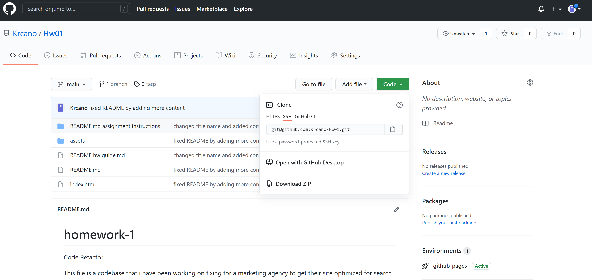

# Homework-1 Code Refactor

## Description:
This project is a codebase for a marketing agency to get their site optimized for search engines and so the it follows accessilbility standards.The following changes made on this code will allow for those with disabilities and their assistive technogies to read the site with ease. 

I first added the alt attributes to the images in the html file so that in the case the images don't load properly then at least a concise description of the image will be there. It will also allow for screen readers to describe the image to those who are visually impaired. I added an appropriate and more descriptive title for the site to show on the tab. I also added an id where the article tag in the search-engine-optimation article so when the viewer presses the link for it it will take them to the right spot on the webpage regarding the search engine optimization heading. I updated the html file for a more semantic structure by adding a header, foooter, article, section and nav tags throughout to replace the majority of the div tags. I added comments throughout both files to show the purpose of the customizations. Along the way there were some issues consolidating the classes because each time i tried to find a solution it broke the code which made me go back to square one. The finished product came about by creating a class selector that covers all the content that shared the same customizations. While the code at first was functional in some ways, doing this cleaned it up.

## Setup:
To get started, install it locally by cloning the repo to your computer by copying the ssh key. 

Then go to your terminal and go to the directory/folder you want to clone the repo to by typing the 'cd <name of file>' command. After, you will you follow the command 'git pull' to download it to your local computer. From there you can type the command 'explorer . ' and it will take you directly to that file in your file explorer. The project should end up looking like the following in your browser:

https://krcano.github.io/Hw01/
 

## MIT License

Copyright (c) [2021] [Kelly R. Cano]

Permission is hereby granted, free of charge, to any person obtaining a copy
of this software and associated documentation files (the "Software"), to deal
in the Software without restriction, including without limitation the rights
to use, copy, modify, merge, publish, distribute, sublicense, and/or sell
copies of the Software, and to permit persons to whom the Software is
furnished to do so, subject to the following conditions:

The above copyright notice and this permission notice shall be included in all
copies or substantial portions of the Software.

THE SOFTWARE IS PROVIDED "AS IS", WITHOUT WARRANTY OF ANY KIND, EXPRESS OR
IMPLIED, INCLUDING BUT NOT LIMITED TO THE WARRANTIES OF MERCHANTABILITY,
FITNESS FOR A PARTICULAR PURPOSE AND NONINFRINGEMENT. IN NO EVENT SHALL THE
AUTHORS OR COPYRIGHT HOLDERS BE LIABLE FOR ANY CLAIM, DAMAGES OR OTHER
LIABILITY, WHETHER IN AN ACTION OF CONTRACT, TORT OR OTHERWISE, ARISING FROM,
OUT OF OR IN CONNECTION WITH THE SOFTWARE OR THE USE OR OTHER DEALINGS IN THE
SOFTWARE.

